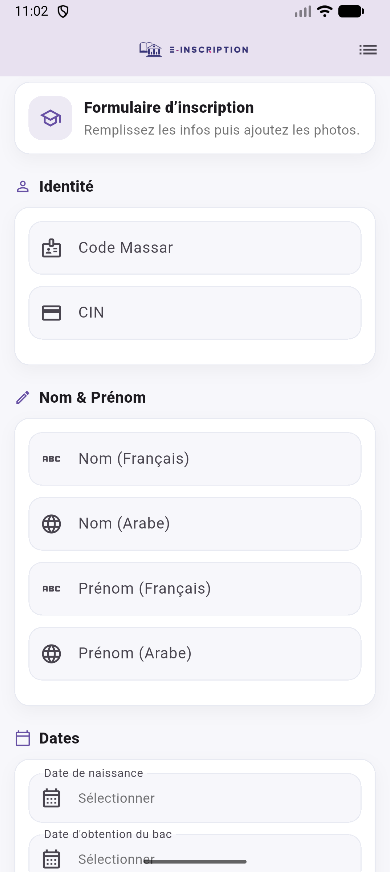
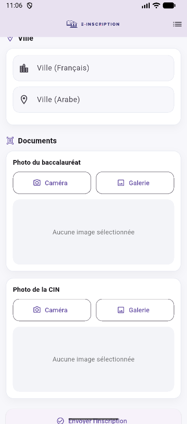
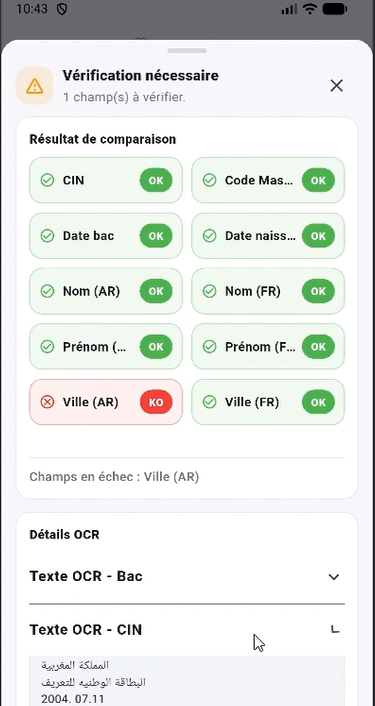
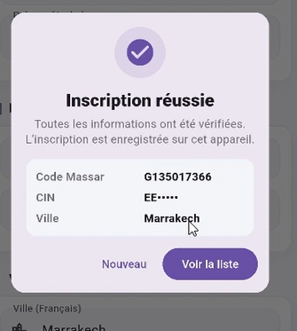
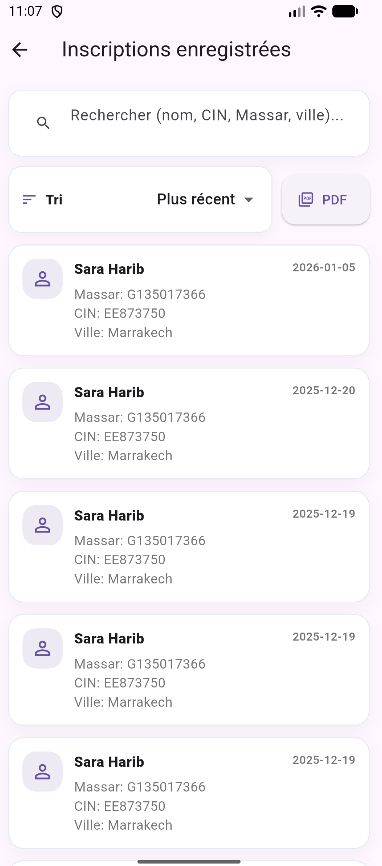

# E-INSCRIPTION 📚✅  

Application **Flutter + Laravel** pour une **pré-inscription** avec **vérification automatique** des informations via **OCR** (Baccalauréat + CIN).  

---

## 🎯 Objectif
Simplifier et sécuriser le processus d’inscription en :
- collectant les informations de l’étudiant,
- vérifiant automatiquement ces informations à partir des documents (BAC + CIN),
- évitant les erreurs de saisie,
- enregistrant localement l’inscription lorsque tout est validé.

---

## ✨ Fonctionnalités principales

### ✅ Côté Mobile (Flutter)
- Formulaire moderne (FR + AR) :
  - Code Massar, CIN
  - Nom/Prénom (Français + Arabe)
  - Dates (naissance + bac)
  - Ville (Français + Arabe)
- Prise/choix des images :
  - Photo du BAC
  - Photo de la CIN
- Envoi des données au backend (multipart/form-data)
- Résultat clair :
  - **Inscription validée** → stockage **SQLite**
  - **Vérification nécessaire** → affichage des champs non validés
- Liste des inscriptions enregistrées localement

### ✅ Côté Backend (Laravel API)
- Endpoint API pour recevoir le formulaire + images
- OCR via **OCR.Space API**
- Extraction du texte et **comparaison automatique** des champs :
  - Nom/Prénom FR
  - Nom/Prénom AR (fuzzy match)
  - CIN 
  - Code Massar 
  - Dates (naissance / bac) via patterns numériques
  - Ville FR (match)
  - Ville AR (fuzzy match sur texte arabe)
- Retour JSON :
  - `status`: `auto_validated` ou `needs_review`
  - `verification`: état champ par champ
  - `ocr`: textes OCR BAC + CIN

---

## 🧱 Architecture du projet
E-INSCRIPTION/
├── inscription_api/ # Backend Laravel (API + OCR)
├── inscription_app/ # Frontend Flutter (Mobile)
└── .gitignore

---

## 🛠️ Technologies utilisées
- **Flutter / Dart** (UI, caméra, galerie, SQLite)
- **Laravel / PHP** (API REST, validation, OCR)
- **OCR.Space API** (reconnaissance de texte)
- **SQLite (sqflite)** (stockage local des inscriptions)

---

## 📸 Démo / Captures d’écran

- Formulaire d’inscription
- Sélection des images BAC/CIN
- Résultat “Inscription faite avec succès”
- Résultat “Vérification nécessaire”
- Liste des inscriptions enregistrées

> 🎥 Vidéo :  
**Lien vidéo :** 
https://drive.google.com/file/d/1bMFfL-PhmkLKD6aBhlruSihvUcmyyPXy/view?usp=drive_link
---

## 🚀 Installation & Exécution

## Backend (Laravel) — `inscription_api`

### Prérequis
- PHP >= 8.x
- Composer
- Laravel
- Clé API OCR.Space

## 👩‍💻 Auteurs

Sara Harib
Hafsa Sabri
Projet Flutter + Laravel — E-INSCRIPTION
